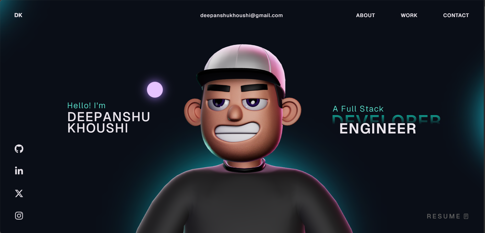

# Deepanshu Portfolio 🚀

A modern, interactive portfolio website showcasing my work and skills as a full-stack developer. Built with cutting-edge web technologies featuring 3D animations, smooth scrolling effects, and responsive design.



## ✨ Features

- **3D Character Animation**: Interactive 3D character with mouse-following animations
- **Smooth Scrolling**: GSAP-powered smooth scrolling with advanced animations
- **Responsive Design**: Fully responsive across all devices
- **Interactive Elements**: Hover effects, cursor animations, and dynamic content
- **Performance Optimized**: Built with Vite for fast development and optimized builds
- **Modern Tech Stack**: React 18, TypeScript, Three.js, and GSAP animations

## 🛠️ Tech Stack

### Frontend Framework
- **React 18** - Modern React with hooks and concurrent features
- **TypeScript** - Type-safe JavaScript development
- **Vite** - Fast build tool and development server

### 3D & Animations
- **Three.js** - 3D graphics and WebGL rendering
- **@react-three/fiber** - React renderer for Three.js
- **@react-three/drei** - Useful helpers for React Three Fiber
- **GSAP** - High-performance animations and scroll triggers

### UI & Styling
- **CSS3** - Modern CSS with animations and transitions
- **React Icons** - Beautiful icon library

### Development Tools
- **ESLint** - Code linting and formatting
- **TypeScript** - Type checking
- **Vercel Analytics** - Web analytics

## 🚀 Getting Started

### Prerequisites

- Node.js (version 16 or higher)
- npm or yarn package manager

### Installation

1. **Clone the repository**
   ```bash
   git clone https://github.com/Deepanshukhoushi/deepanshu-portfolio.git
   cd deepanshu-portfolio
   ```

2. **Install dependencies**
   ```bash
   npm install
   ```

3. **Start the development server**
   ```bash
   npm run dev
   ```

4. **Open your browser**
   Navigate to `http://localhost:5173` to view the portfolio

## 📜 Available Scripts

- `npm run dev` - Start the development server with hot reload
- `npm run build` - Build the project for production
- `npm run preview` - Preview the production build locally
- `npm run lint` - Run ESLint for code quality checks

## 📁 Project Structure

```
deepanshu-portfolio/
├── public/                 # Static assets
│   ├── images/            # Portfolio images and screenshots
│   ├── models/            # 3D model files
│   └── draco/             # Draco compression files
├── src/
│   ├── components/        # React components
│   │   ├── Character/     # 3D character component
│   │   ├── styles/        # Component-specific styles
│   │   └── utils/         # Utility functions
│   ├── context/           # React context providers
│   ├── data/              # Static data files
│   └── assets/            # Imported assets
├── index.html             # Main HTML file
├── package.json           # Project dependencies and scripts
├── vite.config.ts         # Vite configuration
└── tsconfig.json          # TypeScript configuration
```

## ⚠️ GSAP License Note

This project uses GSAP trial plugins for development. For production hosting, you'll need a GSAP Club membership for the full plugins. Learn more at [GSAP Installation Guide](https://gsap.com/docs/v3/Installation/).

## 🤝 Contributing

Contributions are welcome! Please feel free to submit a Pull Request.

1. Fork the project
2. Create your feature branch (`git checkout -b feature/AmazingFeature`)
3. Commit your changes (`git commit -m 'Add some AmazingFeature'`)
4. Push to the branch (`git push origin feature/AmazingFeature`)
5. Open a Pull Request

## 📄 License

This project is open source and available under the [MIT License](LICENSE).

## 📞 Contact

Deepanshu Khoushi - [Portfolio](https://deepanshu-portfolio.vercel.app/)

Project Link: [https://github.com/Deepanshukhoushi/deepanshu-portfolio](https://github.com/Deepanshukhoushi/deepanshu-portfolio)
